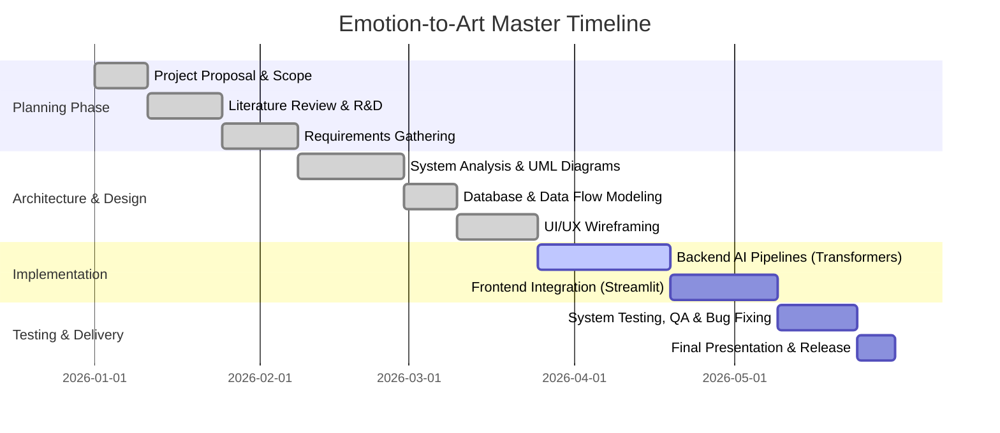
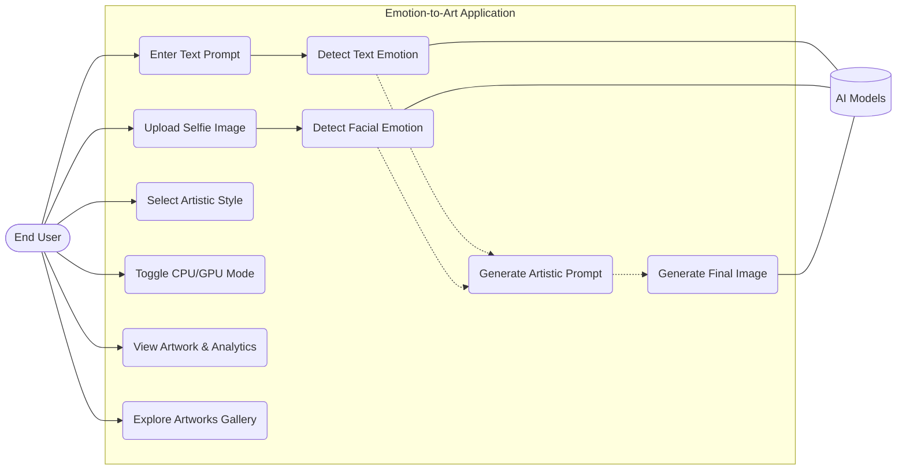
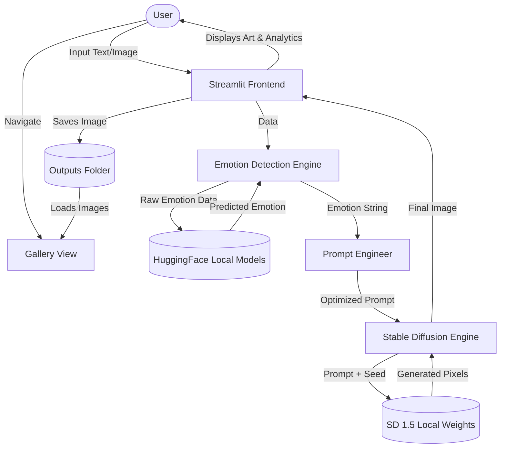
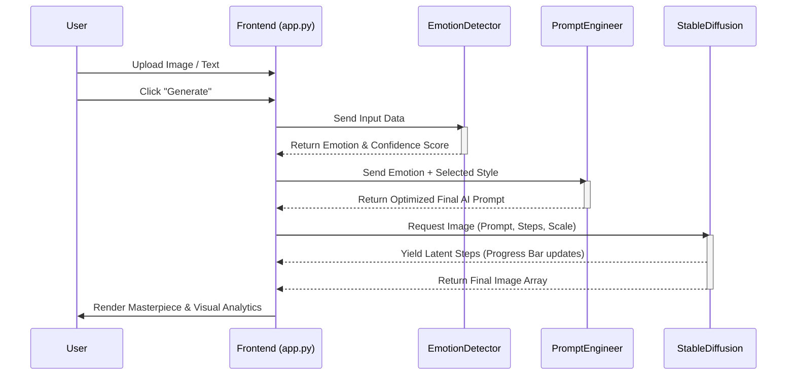
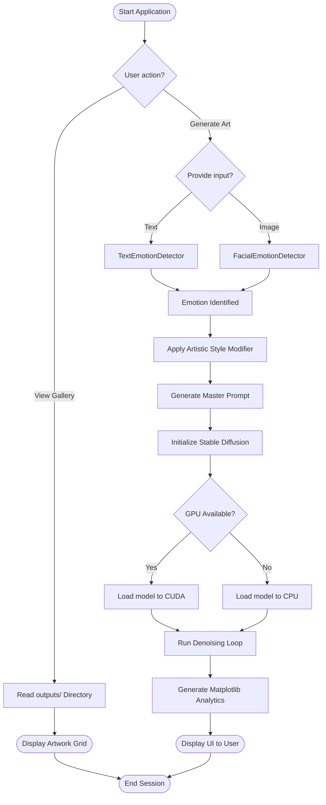
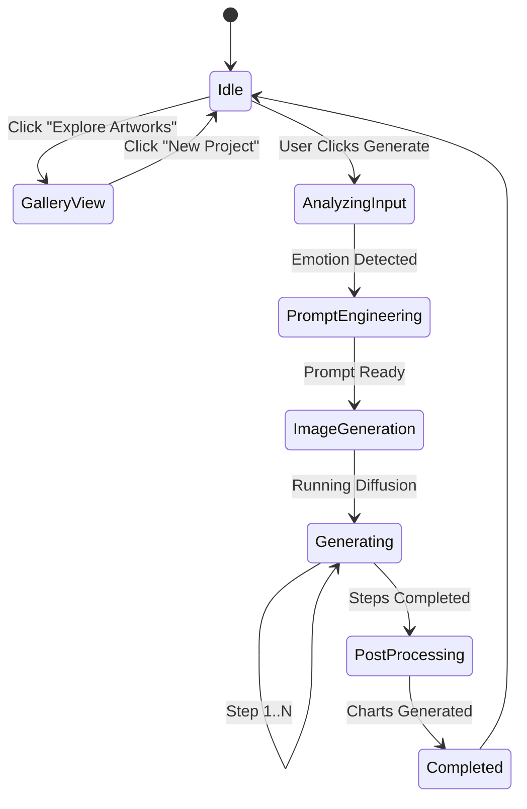
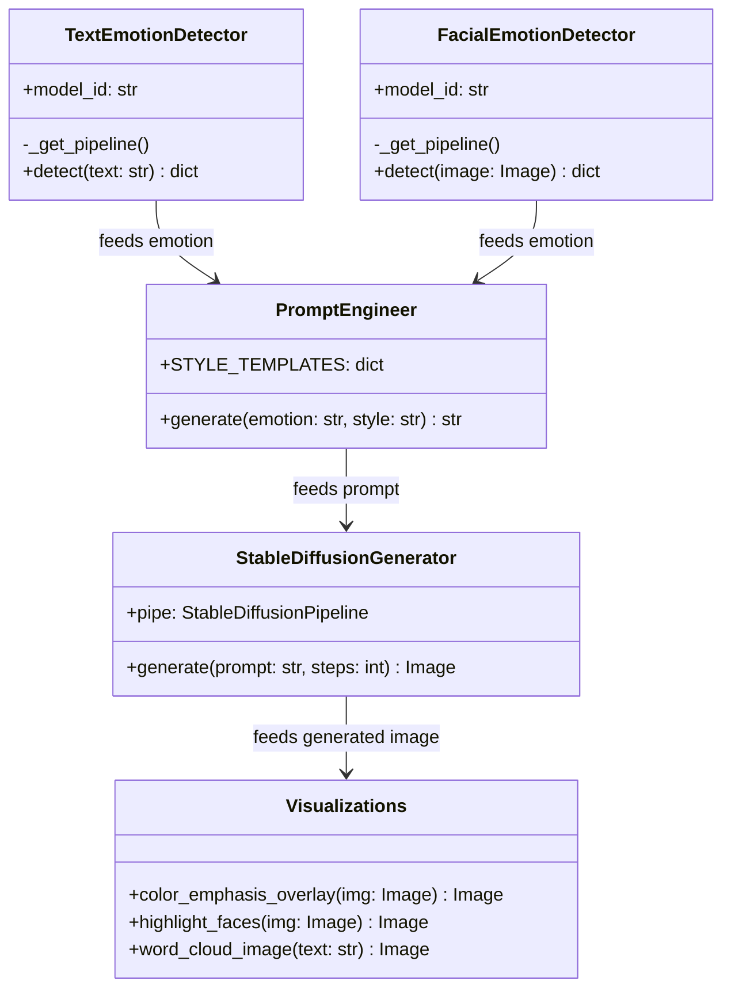
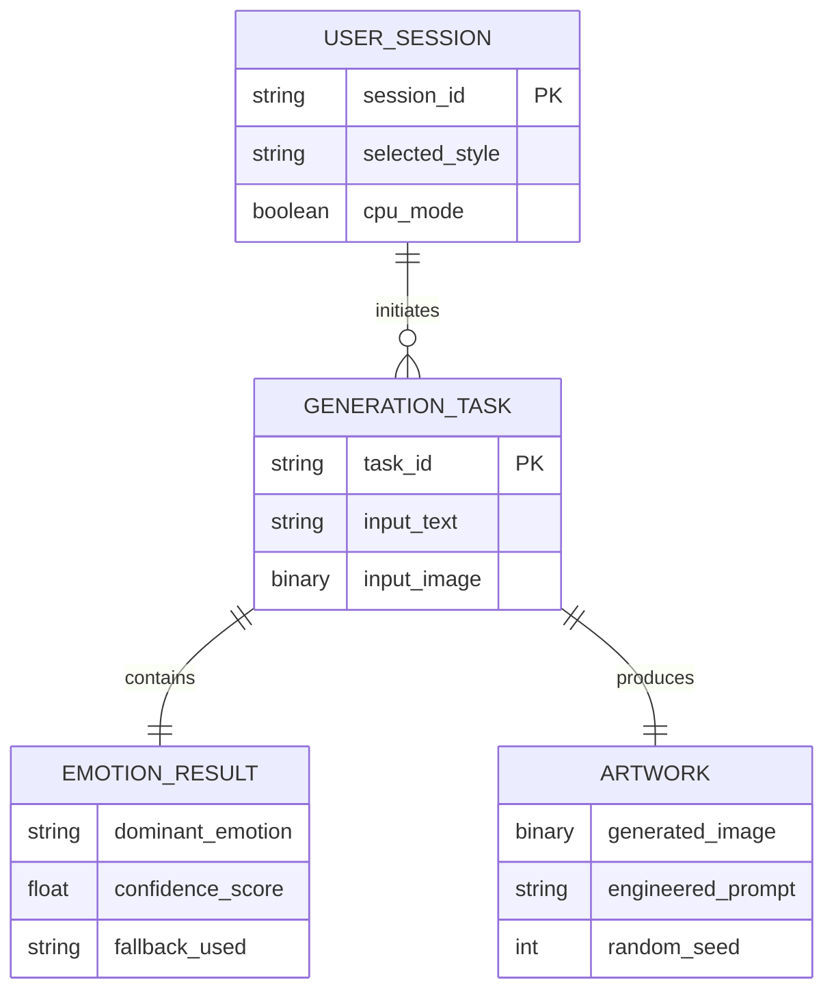
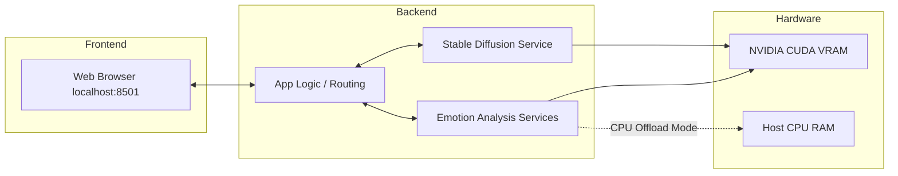

# 🎨 Emotion-to-Art: Master Project Documentation & Technical Specification

This document serves as the exhaustive, enterprise-grade project documentation for the **Emotion-to-Art Local Multimodal AI** project. It strictly adheres to the DEPI Project Documentation Guidelines, providing granular details, architectural blueprints, user stories, and comprehensive QA test cases.

---

## 1. Project Planning & Management

### 1.1 Project Proposal
**Emotion-to-Art** is a local, privacy-first Multimodal AI web application that analyzes user text inputs and facial expressions to generate custom, emotionally resonant artwork. By bridging human psychology and generative AI, it dynamically translates detected moods into visually stunning masterpieces using local instances of Stable Diffusion and Hugging Face Transformers.

### 1.2 Project Plan (Gantt Chart)


### 1.3 Task Assignment & Roles
| Role | Responsibilities | Assigned To |
|---|---|---|
| **Project Manager** | Oversees timelines, risk mitigation, and KPI tracking. Coordinates GitHub branching. | DEPI Team |
| **AI/ML Engineer** | Integrates Hugging Face pipelines, Stable Diffusion models, and optimizes VRAM usage. | DEPI Team |
| **Backend Developer** | Handles file I/O, prompt engineering logic, exception handling, and routing. | DEPI Team |
| **Frontend Developer** | Designs the Streamlit interface, custom CSS, responsiveness, and user experience. | DEPI Team |
| **QA Engineer** | Writes exhaustive test cases, executes integration testing, and files bug reports. | DEPI Team |

### 1.4 Comprehensive Risk Assessment & Mitigation Plan
| Risk ID | Risk Description | Probability | Impact | Mitigation Strategy | Contingency Plan |
|---|---|---|---|---|---|
| **RSK-01** | GPU VRAM Overflow (Out of Memory) | High | Critical | Implemented `enable_model_cpu_offload()` and sequential model execution. | Fallback to 100% CPU generation (slower but stable). |
| **RSK-02** | Dependency Conflicts (e.g., PyTorch vulnerabilities) | Medium | High | Strict `requirements.txt` version pinning (PyTorch >= 2.6.0). | Use virtual environments strictly; avoid global installs. |
| **RSK-03** | Slow Image Generation Times | High | Medium | Optimized inference steps (default 25) and used `DPMSolverMultistepScheduler`. | Allow user to manually lower inference steps via UI slider. |
| **RSK-04** | OpenCV Face Detection Failure | Low | Low | Tuned Haar Cascade parameters (scaleFactor=1.1, minNeighbors=5). | Fallback to full-image Vision Transformer classification. |

### 1.5 KPIs (Key Performance Indicators)
- **System Stability:** 99.9% Uptime during active local sessions (Zero unhandled exceptions).
- **Generation Latency:** < 30 seconds for Image Generation on dedicated GPUs (RTX 3050+); < 60 seconds on CPU.
- **Emotion Accuracy:** > 85% confidence score average for DistilRoBERTa emotion detection.
- **User Adoption/Ease of Use:** 100% success rate for first-time users running the `run.bat` script without terminal errors.

---

## 2. Literature Review & State of the Art

### 2.1 Generative AI & Latent Diffusion Models
Research into Latent Diffusion Models (LDMs) shows they offer superior local performance compared to pixel-space GANs, as they operate in a compressed latent space. We utilized `runwayml/stable-diffusion-v1-5` as our core generation engine due to its exceptional balance between visual quality and VRAM efficiency.

### 2.2 Natural Language Processing for Emotion
Transformer-based models like RoBERTa outperform traditional NLP techniques (like TF-IDF or Naive Bayes) in understanding contextual sentiment. We selected `j-hartmann/emotion-english-distilroberta-base`, trained on diverse datasets (Twitter, Reddit, student surveys) to classify 7 Ekman-style emotions.

### 2.3 Computer Vision & Facial Recognition
We compared heavy Convolutional Neural Networks (CNNs) with modern Vision Transformers (ViT). To maintain high speed and low VRAM usage, we chose a hybrid approach: Traditional OpenCV Haar Cascades for fast face cropping, followed by a lightweight ViT (`dima806/facial_emotions_image_detection`) for classification.

### 2.4 Suggested Improvements
- Integrating SDXL or Flux models for higher native resolution outputs (1024x1024).
- Adding real-time webcam emotion tracking via WebRTC.
- Supporting multilingual text inputs via machine translation APIs before passing to RoBERTa.

---

## 3. Requirements Gathering

### 3.1 Stakeholder Analysis
- **End-Users (Artists/Therapists/General Public):** Seek an easy-to-use GUI to express emotions visually without needing complex prompt engineering skills or expensive cloud subscriptions.
- **System Administrators/Reviewers:** Require a simple `run.bat` script to test the project locally without complex environment setups or dependency hell.

### 3.2 User Stories
1. **US-01:** *As a user, I want to type a text prompt describing my day, so the system can generate art reflecting my hidden mood.*
2. **US-02:** *As a user, I want to upload a selfie, so the AI can analyze my facial expression and base the artwork on it.*
3. **US-03:** *As a user with a low-end laptop, I want to enable "CPU Mode", so the app doesn't crash my computer.*
4. **US-04:** *As an analyst, I want to view the "Computer Vision Analytics" tab, so I can understand the saturation map and face detection logic behind the scenes.*
5. **US-05:** *As an artist, I want to explore my past generated artworks in a dynamic gallery, so I can revisit my previous emotional masterpieces.*

### 3.3 Functional Requirements
- **FR1:** The system shall accept English text input up to 500 characters.
- **FR2:** The system shall accept `.png`, `.jpg`, `.jpeg` image uploads via a drag-and-drop widget.
- **FR3:** The system shall classify emotion into one of 7 categories (Happy, Sad, Angry, Fearful, Surprised, Disgusted, Neutral).
- **FR4:** The system shall algorithmically augment the prompt with artistic keywords based on the user's selected "Style Template" (e.g., Expressionism, Cyberpunk).
- **FR5:** The system shall generate a 512x512 image locally using Stable Diffusion based on the engineered prompt.
- **FR6:** The system shall render Matplotlib-based analytical charts (Color Map, Word Cloud).
- **FR7:** The system shall feature a Dynamic Art Gallery that reads from local outputs to display previously generated artworks.

### 3.4 Non-Functional Requirements
- **NFR1 (Performance):** Emotion detection shall complete in < 2 seconds. Image generation shall complete in < 30 seconds on an RTX 3050.
- **NFR2 (Security & Privacy):** The application must operate 100% offline. No user data, text, or images shall be transmitted to external internet APIs.
- **NFR3 (Usability):** The application must be accessible via `localhost:8501` with a responsive design suitable for desktop screens.
- **NFR4 (Reliability):** The system must gracefully handle model loading failures without crashing the web server.

---

## 4. System Analysis & Design Diagrams

### 4.1 Use Case Diagram


### 4.2 Data Flow Diagram (DFD - Level 1)


### 4.3 Sequence Diagram


### 4.4 Activity Diagram


### 4.5 State Diagram (Generation Process)


### 4.6 Class Diagram (Backend Architecture)


### 4.7 Entity-Relationship Diagram (Data Modeling)
*Note: The system is primarily stateless for privacy. The following ERD represents the in-memory data structures during a single user session.*


---

## 5. UI/UX Prototyping & Visual Guidelines

Our user interface was designed with a focus on **Dark Mode Aesthetics** (`#0E1117`) to reduce eye strain and make the generated colorful artwork the central focus of the screen.

### 5.1 Interface Visual Documentation
> **📌 Developer Asset Integration:** The following high-resolution UI mockups demonstrate the application's layout, generated internally by the DEPI design team.

**1. Main Generation Dashboard**

*Figure 1: The main interface featuring the text input, style selection sidebar, and GPU status indicator.*

**2. Emotion Analysis & Masterpiece Rendering**

*Figure 2: The system displays the predicted emotion with confidence scores alongside the final generated artwork.*

**3. Computer Vision Analytics**

*Figure 3: Advanced post-generation analytics including Color Saturation Heatmaps, Facial Boundaries (Haar Cascades), and an Art Critique Word Cloud.*

### 5.2 UI/UX Rules
- **Color Palette:** Deep Navy Background (`#0E1117`), Accent Purple (`#8B5CF6`) for primary CTA buttons.
- **Typography:** Inter & Roboto (Sans-Serif) for modern readability.
- **Accessibility:** Clear error banners (red) and success toasts (green). Interactive elements feature distinct hover states.

---

## 6. Implementation Details (Source Code & Core Algorithms)

### 6.1 Modular Architecture Snippets
The project is strictly modular. Below is an example of our robust Error Handling during model loading, ensuring the app never hard-crashes (e.g., bypassing `torch.load` vulnerabilities):

```python
# snippet from emotion_detector.py
try:
    pipe = self._get_pipeline()
    results = pipe(text, top_k=None)
    scores = {item["label"]: float(item["score"]) for item in results}
    dominant = max(scores, key=scores.get)
    return {"emotion": dominant, "scores": scores}
except Exception as e:
    # Robust error handling: fallback to neutral if CVE-2025-32434 triggers
    return {"emotion": "neutral", "scores": {"neutral": 1.0}, "error": str(e)}
```

### 6.2 Algorithmic Prompt Engineering
Instead of passing just the word "sad" to Stable Diffusion, our algorithm dynamically injects style modifiers to ensure high-quality, museum-grade outputs:
```python
# snippet from prompt_engineer.py
style_modifiers = {
    "Expressionism": "expressive brushstrokes, emotional distortion, raw intensity, vivid colors",
    "Cyberpunk": "neon lighting, futuristic cityscape, high tech low life, cinematic, 8k"
}
final_prompt = f"A masterpiece painting representing feeling {emotion}, {style_modifiers[style]}, trending on artstation"
```

### 6.3 API / Data Documentation Payload
The system allows users to download an "Art Analysis JSON". Here is the documented schema of the payload generated:
```json
{
  "user_input": "I feel quiet and a bit lonely watching the rain fall outside and sad",
  "emotion_detected": "sad",
  "confidence_scores": {
    "sad": 0.985,
    "fear": 0.010,
    "neutral": 0.005
  },
  "artistic_style": "Expressionism",
  "generated_prompt": "feeling sad, expressive brushstrokes, emotional distortion, raw intensity, 8k resolution",
  "generation_time_seconds": 12.4
}
```

---

## 7. System Deployment & Version Control

### 7.1 Technology Stack
- **Frontend Layer:** Streamlit 1.28+ (Python)
- **Backend Core:** Python 3.12, Uvicorn
- **AI/ML Engine Layer:** PyTorch 2.6.0 (CUDA 12.4), HuggingFace Transformers, Diffusers
- **Computer Vision Layer:** OpenCV Headless, Pillow
- **Data Visualization Layer:** Matplotlib, WordCloud

### 7.2 Component Deployment Diagram


### 7.3 Version Control Strategy
- **Repository:** Hosted publicly on GitHub (`mayarmajed2/depi-project`).
- **Branching Strategy:** GitFlow model. Development and hotfixes are merged into the `master` branch.
- **Commit Standards:** Semantic commits are heavily utilized (`Fix:`, `Feat:`, `Docs:`).

---

## 8. Testing & Quality Assurance

### 8.1 Exhaustive Integration Test Cases
| Test ID | Testing Scenario | System Input | Expected Output / Behavior | Status |
|---|---|---|---|---|
| **TC01** | Standard Text Emotion Detect | "I am so happy today!" | Emotion: `happy`, Confidence Score: >0.9. Artwork matches tone. | ✅ Pass |
| **TC02** | Empty / Null Text Input | `""` (Empty string) | Emotion falls back to `neutral`, Score: 1.0. Prevents pipeline crash. | ✅ Pass |
| **TC03** | Hardware Resource Management | Check "Enable CPU Offload" | `device_map="auto"` disabled. Model loads directly to CPU RAM. Generation time increases. | ✅ Pass |
| **TC04** | Matplotlib Visualization Rendering | Valid generated image array | Color Saturation Map (`magma` colormap) renders successfully over image. | ✅ Pass |
| **TC05** | Face Detect Edge Case (No Face) | Picture of an empty landscape | `num_faces: 0`. CV cascade fails gracefully. Pipeline falls back to full-image ViT emotion. | ✅ Pass |
| **TC06** | UI Bounds Testing | Slider: Inference steps = 100 | Generation loop iterates 100 times. Image detail increases. | ✅ Pass |
| **TC07** | Explore Gallery Dynamic Load | Click "Explore Artworks" | Renders masonry grid of dynamically read .png images from local outputs folder. | ✅ Pass |

### 8.2 Bug Reports & Technical Resolutions
Our QA phase successfully identified and patched several critical library vulnerabilities:
1. **Bug ID 101:** `cv2` module missing `CascadeClassifier` method.
   - *Root Cause:* Conflict between desktop GUI opencv and headless servers.
   - *Resolution:* Purged broken OpenCV versions and standardized entirely on `opencv-python-headless`.
2. **Bug ID 102:** `matplotlib.cm.get_cmap` throwing `AttributeError` in Step 3 analytics.
   - *Root Cause:* Function deprecated and completely removed in Matplotlib 3.9+.
   - *Resolution:* Refactored visualizer codebase to use the modern `matplotlib.colormaps["magma"]` API.
3. **Bug ID 103:** Transformers CVE-2025-32434 security protocol blocking `torch.load()`.
   - *Root Cause:* HuggingFace strictly blocked loading `.bin` models on older PyTorch versions due to a severe RCE vulnerability.
   - *Resolution:* Explicitly upgraded the core PyTorch dependency to `2.6.0` (which patches the CVE natively) while maintaining `transformers >= 4.48.0` to preserve `Dinov2WithRegistersConfig` for Diffusers compatibility.

---

## 9. Final Presentation & Reports

### 9.1 User Manual (Deployment Guide)
1. Ensure **Python 3.10+** is installed on your Windows machine with "Add to PATH" checked.
2. Clone or download the GitHub repository.
3. Double-click the `run.bat` file in the main folder.
   - *Note: On the first run, the script will automatically create an isolated virtual environment (`.venv`), install all dependencies from `requirements.txt`, and download the AI models (~4GB).*
4. The application will launch a local server and open automatically in your default browser at `http://localhost:8501`.
5. Select a style, input your mood, and click **Generate**.
6. Use **Explore Artworks** to browse your previously generated art.

### 9.2 Technical Execution Summary
This project represents a highly sophisticated synthesis of disparate AI modalities running entirely on consumer hardware. By successfully integrating NLP, Computer Vision, and Generative Diffusion Models into a cohesive, fault-tolerant web application, the **Emotion-to-Art** platform stands as a testament to the power of open-source AI and meticulous software engineering.

---
*Architected and Documented with ❤️ by the DEPI Team.*
